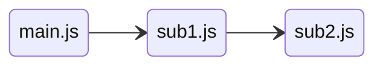
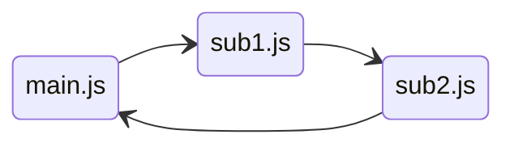
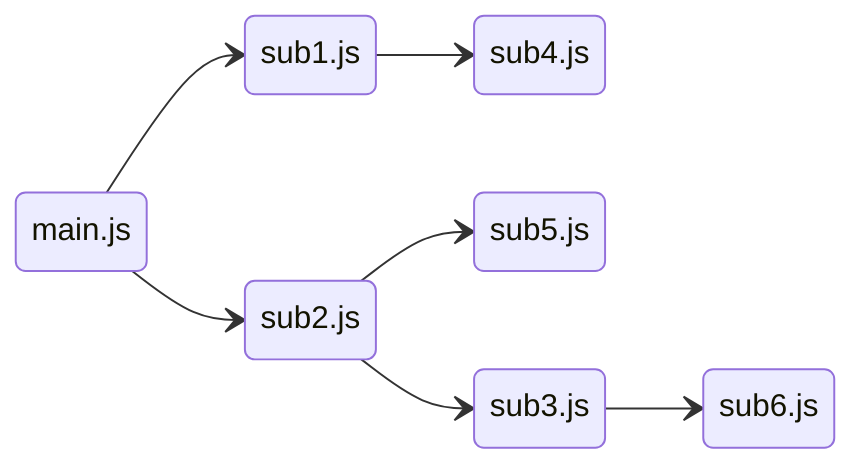
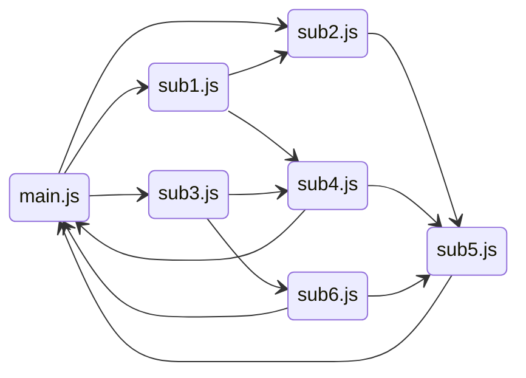

# 依存関係の例

参考：[プログラムの依存関係とモジュール構成のこと](https://qiita.com/wm3/items/2c90bfd9e973d368ebd8)

## 依存関係 OK パターン



```typescript
// main.js
import sub1 from "sub1";  // <=== sub1 に依存

function main() {
      :
}
```

```typescript
// sub1.js
import sub2 from "sub2";  // <=== sub2 に依存

function sub1() {
      :
}
```

```typescript
// sub2.js
function sub2() {
      :
}
```

## 依存関係 NG パターン



```typescript
// sub2.js
import main from "main";  // <=== main に依存

function sub2() {
      :
}
```

## 依存関係 OK パターン



## 依存関係 NG パターン


