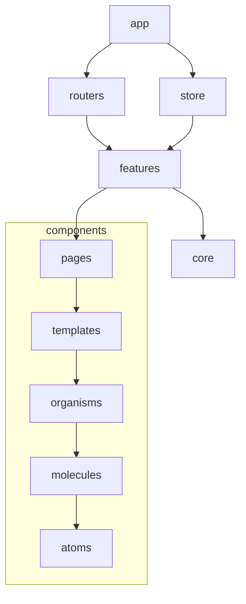

```mermaid
graph TD;
  app --> store
  app --> routers
  routers --> features
  store --> features
  subgraph components
    pages --> templates
    templates --> organisms
    organisms --> molecules
    molecules --> atoms
  end
  features --> pages
  features --> core
```
